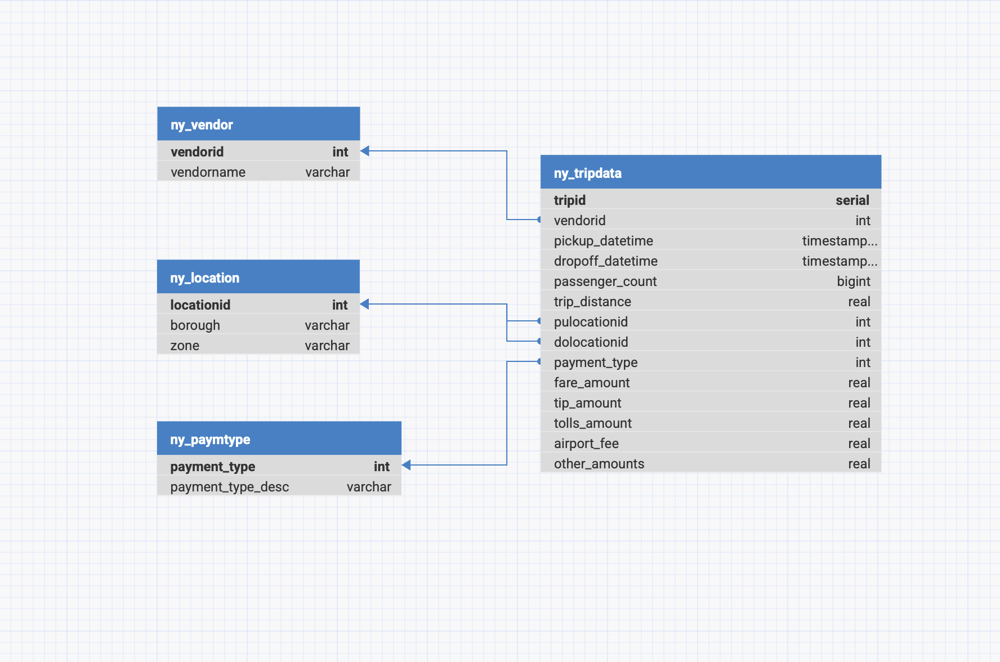

# NYC Yellow Taxi ETL Project 🚖

This project demonstrates an end-to-end ETL (Extract, Transform, Load) pipeline using **PySpark**. It processes NYC Yellow Taxi trip data, performs data cleaning and transformation, and loads the result into a dimensional PostgreSQL database.

---

## 📁 Project Structure
<pre> <code>
nyc-taxi-etl/
├── data/ # Contains raw or sample input files
├── python_scripts/
│ ├── config.py # Contains configuration information
│ ├── extract.py # Extracts data from CSV or Parquet files
│ ├── transform.py # Cleans and transforms the dataset
│ └── load.py # Load transformed data to PostgreSQL database
├── sql_scripts/
│ └── create_table.sql # SQL scripts to create tables in the PostgreSQL database
├── diagrams/
│ └── erd_project1.png # Table structure
├── run_etl.py # Orchestrates the full ETL pipeline
└── README.md # Project documentation</code> </pre>

---

## 📦 Technologies Used

- **Python 3.x**
- **PySpark**
- **PostgreSQL**
- **Git / GitHub**
- **NYC Yellow Taxi Dataset**
  Source: [NYC Taxi & Limousine Commission](https://www.nyc.gov/site/tlc/about/tlc-trip-record-data.page)

---

## 🔄 ETL Process Overview

- **Extract**: Loads raw trip data from CSV or Parquet
- **Transform**:
  - Handles missing/null values
  - Filters invalid rows (e.g., negative fares, zero distances)
  - Converts timestamps and calculates trip duration
  - Verifies `total_amount` equals the sum of individual charges
- **Load**: Saves clean data to the database

---

## 🚀 How to Run It
- **Run** `run_etl.py`
---

## ETL Flow Diagram

